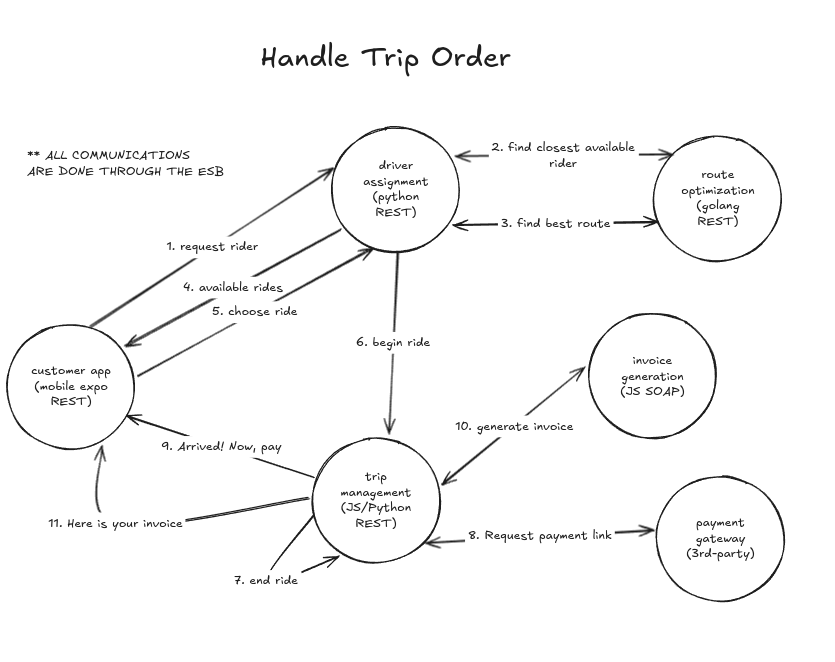

# REBU

REBU (an UBER alternative)

## Overview

This is the use case we are trying to implement simplified. All apps will have **dummy** endpoints (there are no databases involved). Each app has its description and required work in the README file of the corresponding folder.

## Contributing

Clone the repo, do your thing (in a branch with the name of the app), push the code and open a PR.

Make sure your app is working, we don't care about code quality.

**Your work is not done until it gets merged in main**.
