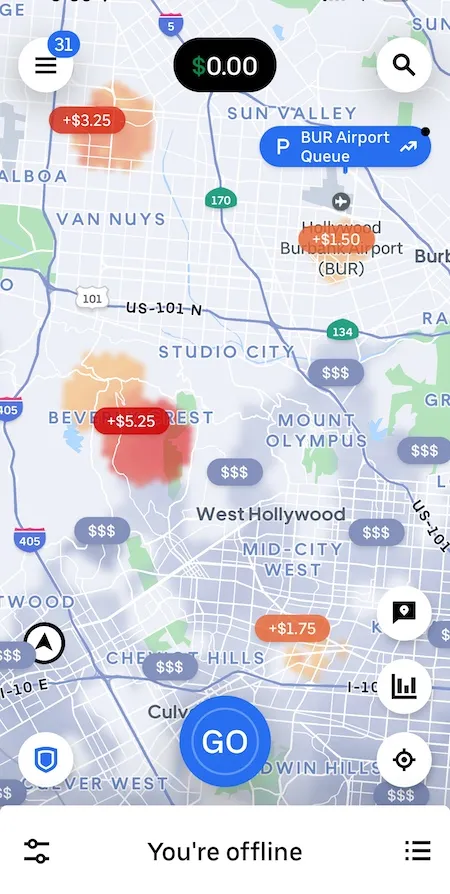
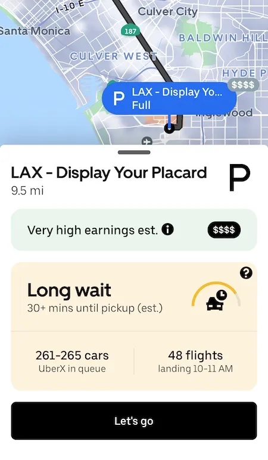
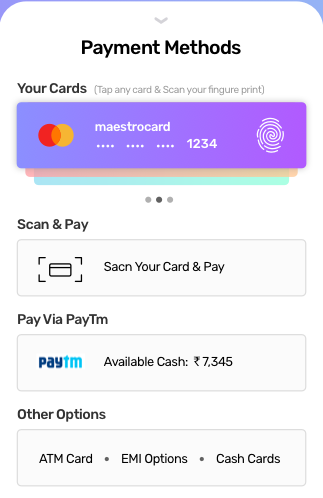

# REBU Ride Customer App

This is a mobile app. You may code it however you want. I recommend [Expo](https://expo.dev/) as it is super easy to use (React + no android stuff needed + very easy development experience + you may help yourself with [v0](https://v0.dev/)).

This app is used by the customer to request a ride.

Everything in the app is static / hard-coded (all data), **except for the communications URLs**. All URLs should be in a `.env` file.

May be done by **at most 2 persons**.

## Required screens

On app opening, an initial screen that has a button "go" is displayed.



Clicking on this button sends a request to the `driver assignment app` which will respond with the possible rides.
The UI should change to a screen like this one:



It should display the itinerary (from where to where to go), how much it will last and a button to approve.

Once the customer clicks on the "approve" button, the screen changes to an ongoing trip. This should also send a request of approval to the `driver assignment app`.

After this, it should poll on the `trip management app` to see if the trip has ended or not.

Once the trip ends, It should display a payment screen like this:



The screen should contain a button "pay". Once clicked, it should send a request to the `trip management app` to notify it that the payment has been done and it should respond with your invoice. Now, you should display a screen that indicates that the trip ended.

## Description of communications:

All communications are RESTful and use JSON.

There are 2 main apps to communicate with: `driver assignment app` and `trip management app`. So, your `.env` should contain something similar to this:

```.env
DRIVER_ASSIGNMENT_APP=http://localhost:9001
TRIP_MANAGEMENT_APP=http://localhost:9002
```

1. 1st request:

```json
{
  "type": "request_ride",
  "user": {
    "name": "",
    "location": ""
  },
  "destionation": ""
}
```

Please put the `type` field as is. You are free to fill the rest with any static data you want.

The `driver assignment app` should respond with something like this (you may disregard data inside):

```json
{
  "type": "available_ride",
  "duration": "",
  "route": ["", "", "", ""],
}
```

2. 2nd request:

```json
{
  "type": "ride_approval",
  "user": {
    "name": "",
    "location": ""
  },
  "destionation": ""
}
```

Please put the `type` field as is. You are free to fill the rest with any static data you want.

The `driver assignment app` should respond with something like this (you may disregard data inside):

```json
{
  "type": "ride_begin"
}
```

3. 3rd request:

You should poll in this one.

```json
{
  "type": "ride_finish_check",
  "user": {
    "name": "",
    "location": ""
  },
  "destionation": ""
}
```

Please put the `type` field as is. You are free to fill the rest with any static data you want.

The `trip management app` should respond with something like this:

- Trip did not end yet:

```json
{
  "type": "ride_not_yet_finished"
}
```

- Trip ended:

```json
{
  "type": "ride_finished",
  "cost": "",
  "payment_url": ""
}
```

4. 4th request:

```json
{
  "type": "payment_done",
  "user": {
    "name": "",
    "location": ""
  },
  "destionation": ""
}
```

Please put the `type` field as is. You are free to fill the rest with any static data you want.

The `trip management app` should respond with something like this:

```json
{
  "type": "ride_end"
}
```
